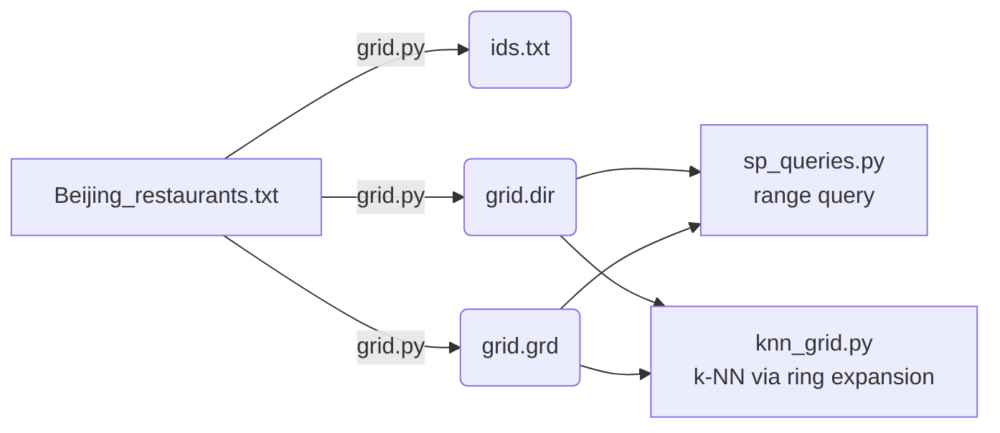

# Spatial Data Searching

A from-scratch implementation of a **flat-file grid spatial index** for fast range and k-nearest-neighbour (k-NN) queries over 2D point data, built and benchmarked on ~52,000 real restaurant locations in Beijing.

No GIS libraries, no databases — just a custom on-disk index (`grid.dir` + `grid.grd`) and the search algorithms that exploit it, written in pure Python.

[](https://github.com/ChristosGoulas/Spatial_Data_Searching/actions/workflows/ci.yml)


## Why this exists

Naively answering "which points fall in this box?" or "what are this point's k nearest neighbours?" over a large point set means scanning every record — O(n) per query. This project builds a simple uniform grid index once, then answers both query types by touching only the handful of cells that could possibly contain a match.

| Query type | Brute force | Grid-accelerated |
|---|---|---|
| Range query | O(n) | O(n / cells) average, plus overlap |
| k-NN | O(n) | O(k) expected for uniformly distributed data |

## How the index works

1. **Partition** the bounding box of all points into a `d × d` grid (default `10 × 10`).
2. **Bucket** each point into its cell based on (x, y).
3. **Persist** the buckets as two flat files:
   - `grid.grd` — point records (`id x y`), grouped by cell, written back-to-back.
   - `grid.dir` — one line per non-empty cell: `cell_x cell_y byte_offset record_count`, plus a header with the overall bounding box.

At query time, the directory file is loaded into memory (it's tiny — one entry per cell) and used to `seek()` directly to the relevant byte ranges in `grid.grd`, avoiding a full file scan.



### k-NN via ring expansion (`knn_grid.py`)

Starting at the query point's home cell, the search visits cells in expanding square "rings" (Chebyshev distance 0, 1, 2, ...), keeping a bounded max-heap of the `k` best candidates seen so far. It stops as soon as the heap is full **and** the closest possible point in the next unvisited ring is farther away than the current k-th best distance — so it never visits more cells than necessary.

## Project structure

```
grid.py             # Builds the grid index from a raw points file
sp_queries.py        # Range query using the grid index
knn_grid.py          # k-NN query using the grid index (ring expansion)
knn_bruteforce.py    # k-NN by scanning every point — correctness baseline
tests/               # pytest suite: grid results validated against brute force
```

## Getting started

```bash
git clone https://github.com/ChristosGoulas/Spatial_Data_Searching.git
cd Spatial_Data_Searching
python3 -m venv .venv && source .venv/bin/activate
pip install -e .[dev]
```

### Build the index

```bash
python3 grid.py Beijing_restaurants.txt
```

Produces `ids.txt`, `grid.grd`, and `grid.dir` in the current directory.

### Range query

Find every point in a bounding box:

```bash
python3 sp_queries.py 39.72 39.74 116.11 116.13
```

### k-NN query

5 nearest neighbours to a point, using the grid index:

```bash
python3 knn_grid.py 5 39.73 116.12
```

Same query, brute force (for comparison / verification):

```bash
python3 knn_bruteforce.py 5 39.73 116.12
```

## Testing

The test suite builds a small synthetic dataset, indexes it, and asserts that both the range query and the grid-based k-NN search return **exactly** the same points as a brute-force scan.

```bash
pytest -v
```

## Development

```bash
black .        # format
flake8 .       # lint
mypy .         # type-check
```

CI runs the full lint + test suite on every push via GitHub Actions (`.github/workflows/ci.yml`).

## Possible extensions

- Adaptive grid dimension based on point density (currently a fixed `d × d` grid).
- Quadtree / R-tree index for skewed spatial distributions.
- Binary record format instead of text, to shrink `grid.grd` and speed up I/O.

## License

MIT — see [LICENSE](LICENSE).

